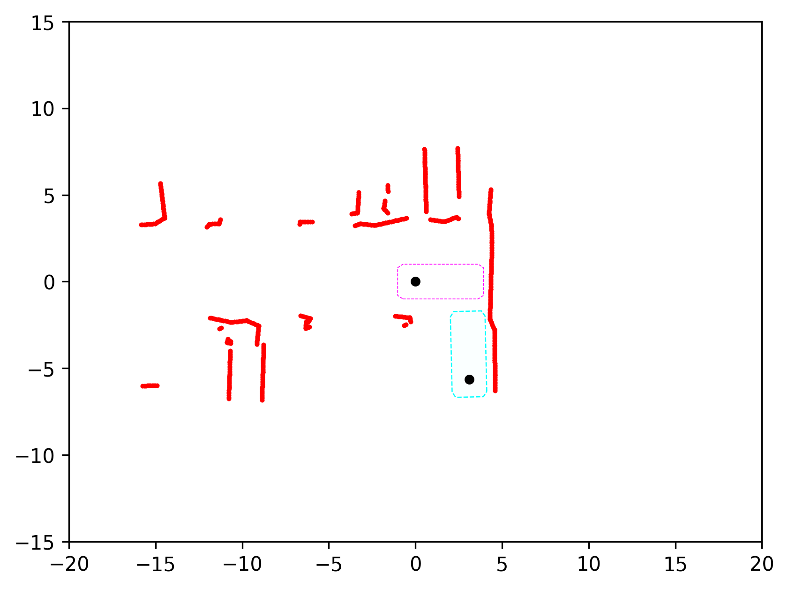
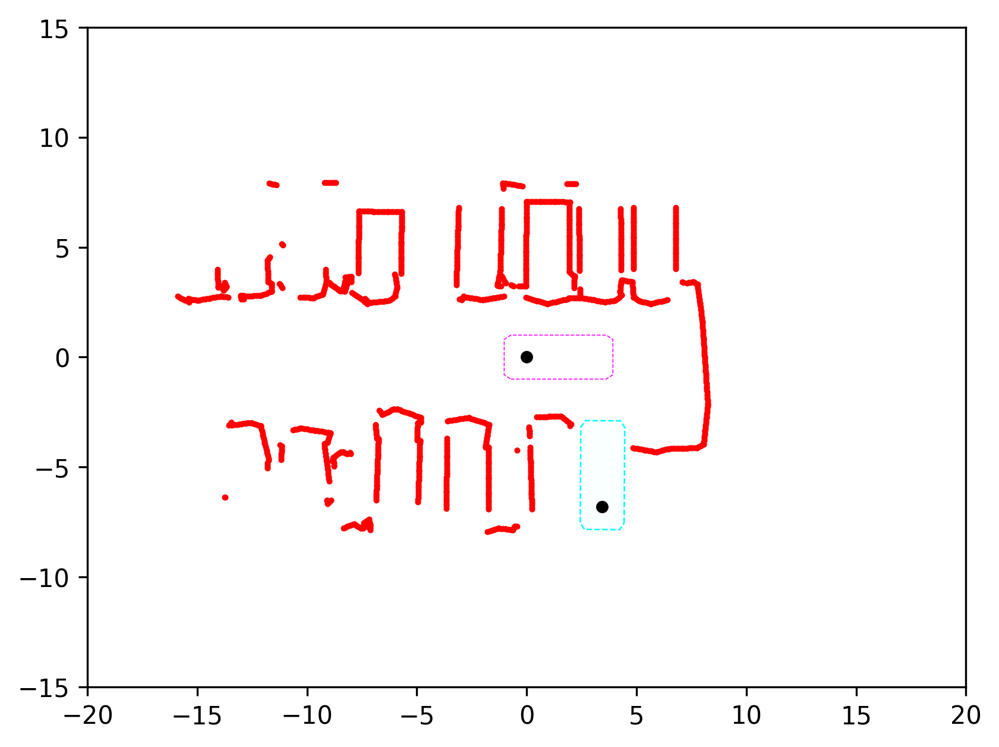
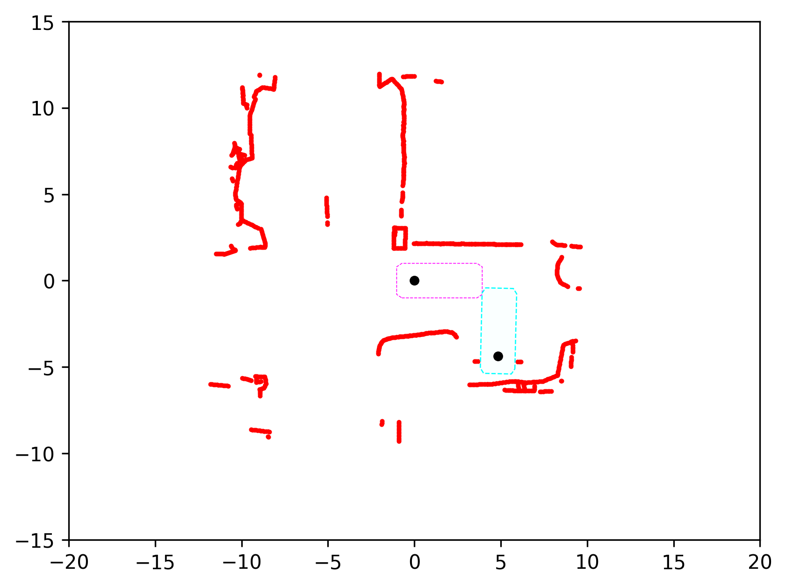

# Constrained Parking Scenarios (ParkBench)

This repository contains **51 constrained rear-in parking scenarios** (**ParkBench**) for research and benchmarking in autonomous parking and motion planning.

Each scenario is provided as a JSON file and describes a tightly constrained parking environment, including the ego vehicle start pose, target parking pose, and surrounding static obstacles.

The dataset is designed for **academic research and educational use**, with a focus on challenging, real-world-like parking layouts such as narrow slots, walls, and corridor-style constraints.

---

## Dataset Overview

- **Number of scenarios:** 51  
- **Parking type:** Rear-in  
- **Format:** JSON  
- **Coordinate system:** Scenario-specific local frame with provided origin transforms  

Each scenario includes:
- Ego vehicle initial pose `(x, y, θ)`
- Target parking pose `(x, y, θ)`
- Obstacle boundaries represented as polygonal polylines
- Frame origin and planning metadata


### Scenario Visualization
Below are three representative parking scenarios. Static obstacles are shown in red, the start pose in magenta, and the target pose in cyan.

<table>
  <tr>
    <td align="center">
      <br>
      <b>(1) Dead End</b>
    </td>
    <td align="center">
      <br>
      <b>(2) Corridor</b>
    </td>
    <td align="center">
      <br>
      <b>(3) Corner</b>
    </td>
  </tr>
</table>

---

## Feature Extraction Utility

A utility function is provided in `utils.py` to extract structured scene information from a scenario JSON file.

### Function

```python
ego_info, target_info, obstacle_points, obstacle_polylines = load_json_feature(filename, interp_dist=0.1)
```

## Returned Data  

All returned data are expressed in the **same world coordinate system**.

- **`ego_info`**  
  **Format:** `[x, y, theta]`  
  **Description:** Ego vehicle pose in the world coordinate system.

- **`target_info`**  
  **Format:** `[x, y, theta]`  
  **Description:** Target parking pose in the world coordinate system.

- **`obstacle_points`**  
  **Type:** `np.ndarray`  
  **Shape:** `(N, 2)`  
  **Description:** Interpolated and filtered obstacle point cloud in the world coordinate system.

- **`obstacle_polylines`**  
  **Type:** `List[List[List[float]]]`  
  **Description:** Original obstacle boundaries represented as polygonal polylines in world coordinates.


## Notes

- Obstacle boundaries are **interpolated** at a configurable spatial resolution (`interp_dist`)
- Obstacle points **overlapping the target vehicle bounding box are filtered out**
- Heading angles are **normalized into the range** `[-π, π]`
- There may be some outliers among the obstacle points, i.e., a small number of points may lie far outside the main scene.


## License

#### Dataset

- All parking scenario JSON files are released under  
  **Creative Commons Attribution–NonCommercial 4.0 (CC-BY-NC-4.0)**.
- The dataset is intended for **academic research and educational use only**.
- **Commercial use is prohibited** without explicit permission.

#### Code

- All example scripts and utilities are released under the **MIT License**.


## Citation

If you use this dataset in academic work, please cite:

```bibtex
To do 
 

